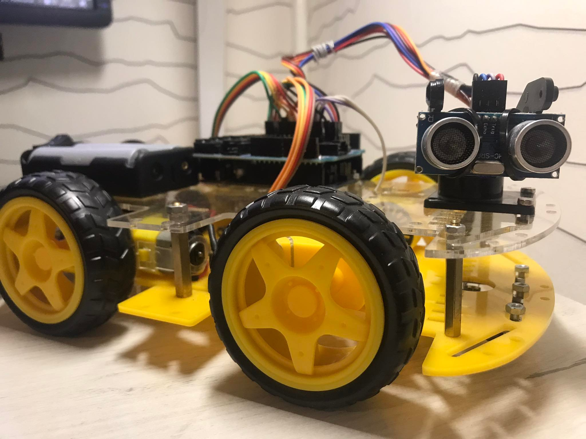
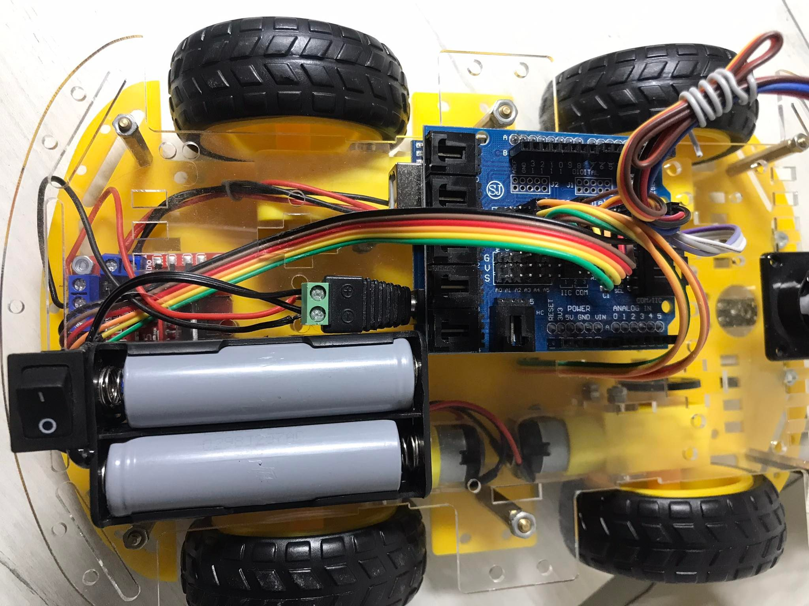
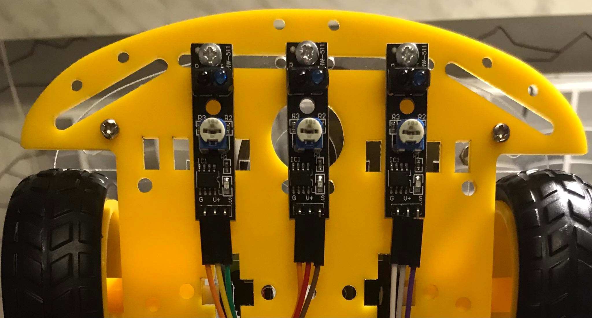
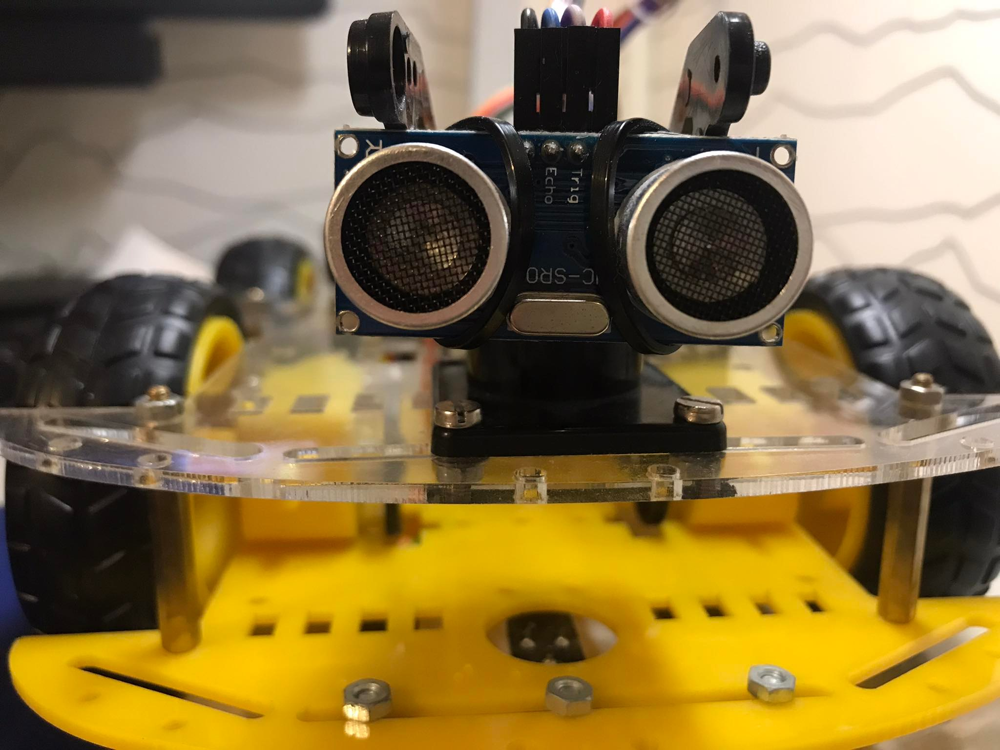
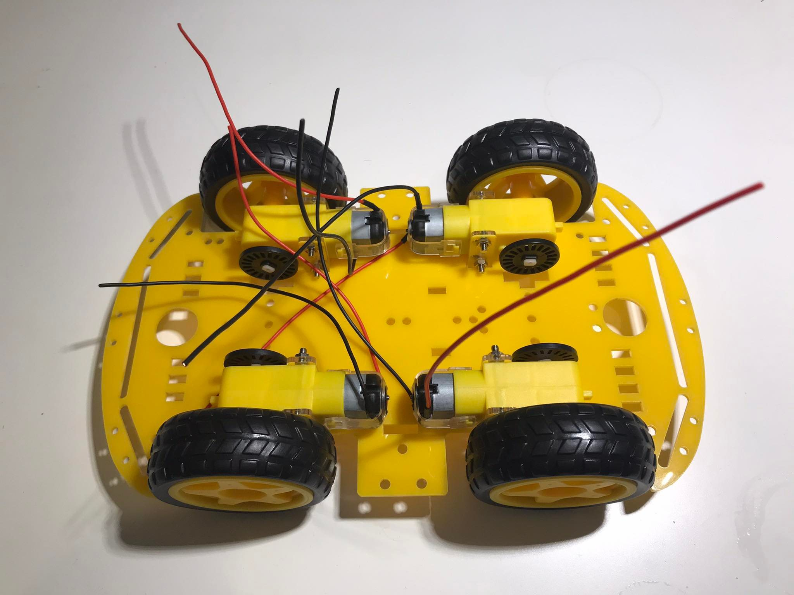
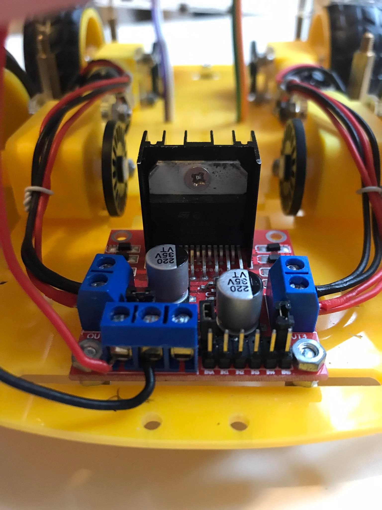

# arduino-line-follower

My Line Follower robot is equipped with sensors, a control system, and an executive system. The sensors enable the robot to detect information from its environment. The task of the control system is to interpret the data recorded by the sensors and issue appropriate commands to the executive system. The robot detects the presence of a black line on a white surface using three reflective infrared sensors mounted on the chassis. To identify obstacles on its path, the device employs an ultrasonic distance sensor.

# Detailed documentation

[Link to PDF documentation](arduino-line-follower/arduino-line-follower.pdf)
# Photos

**Front view**:

**Top view**:

**IR sensors**:

**Ultrasonic sensors**:

**Chassis**:

**Control module**:

